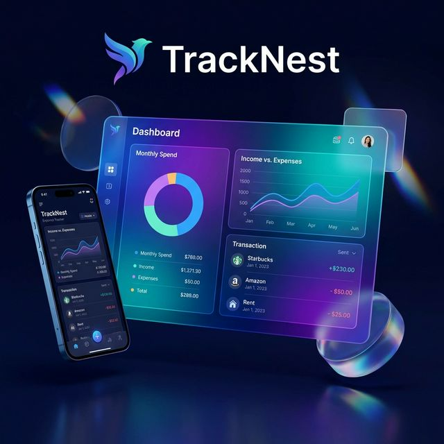
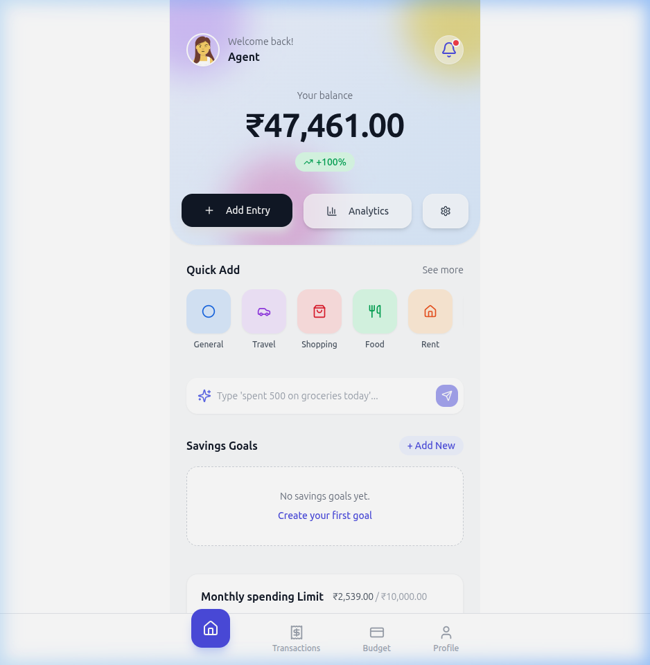
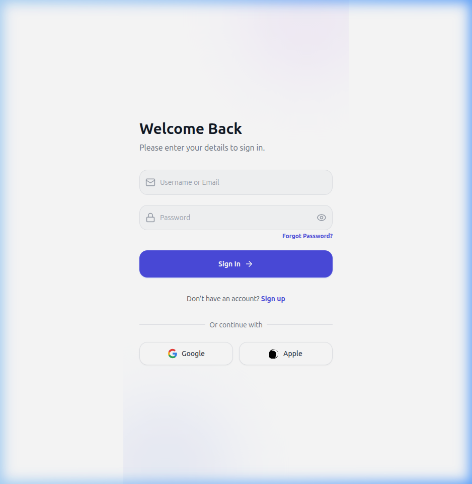
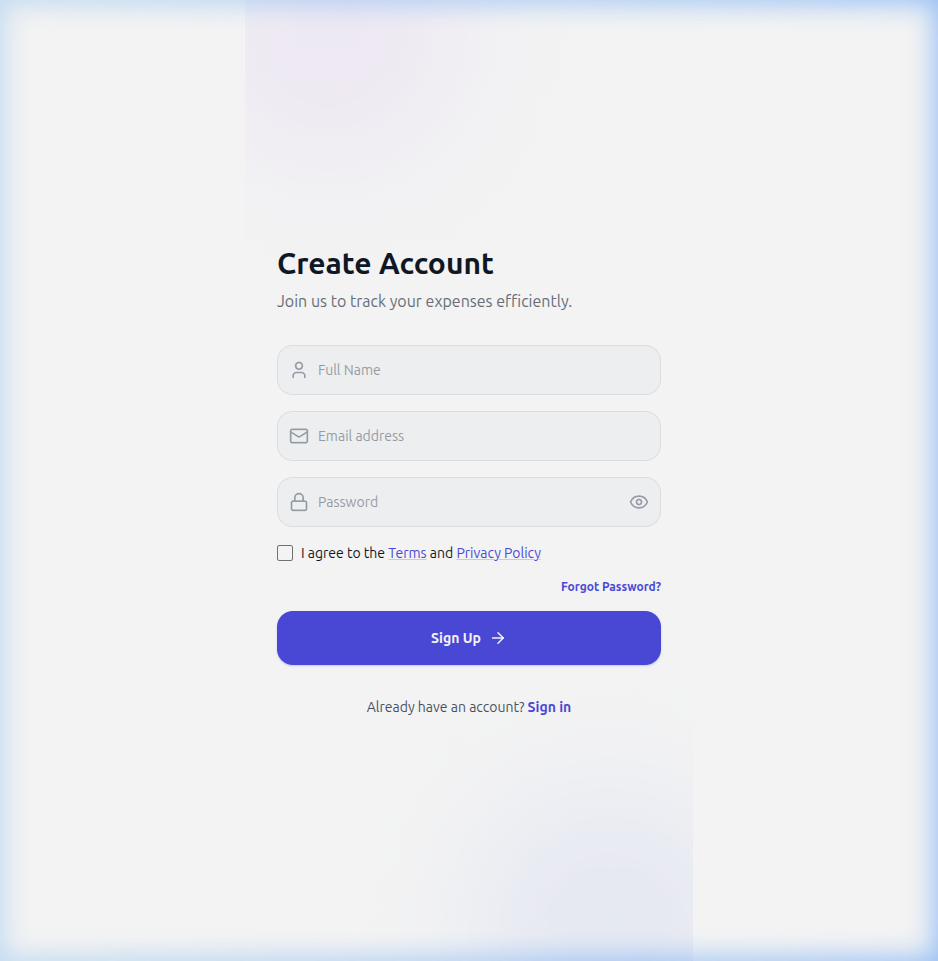
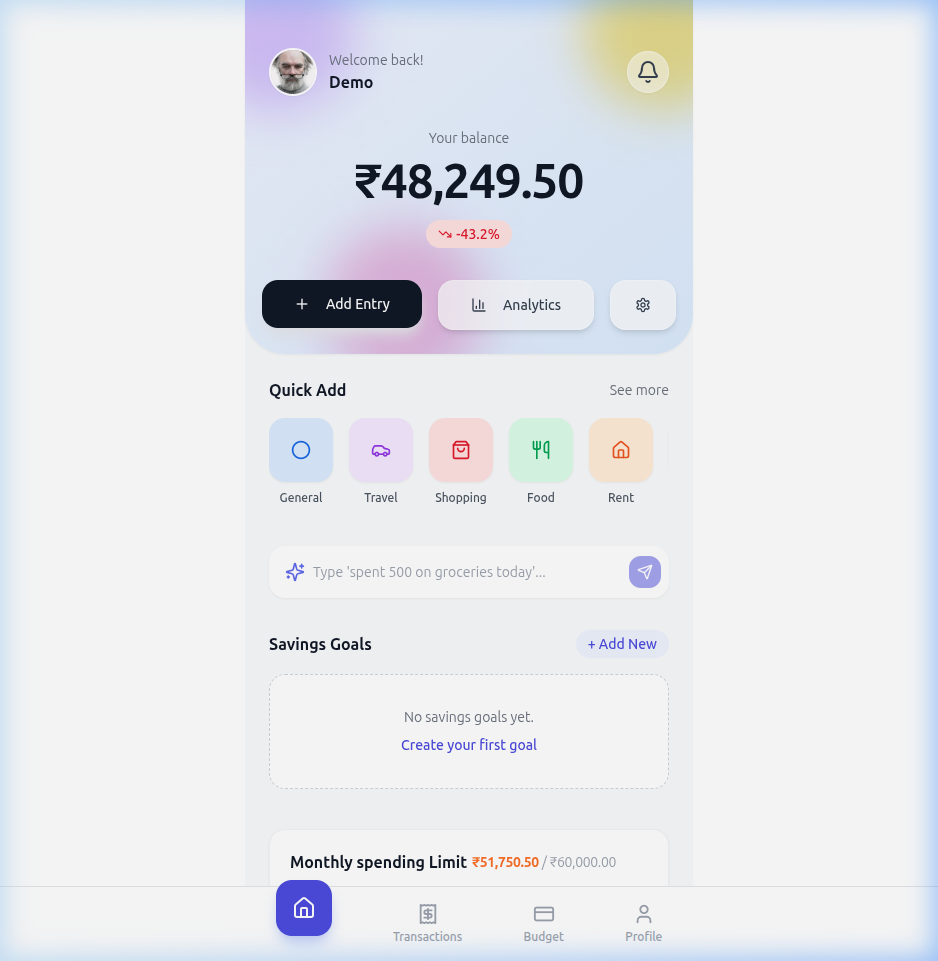
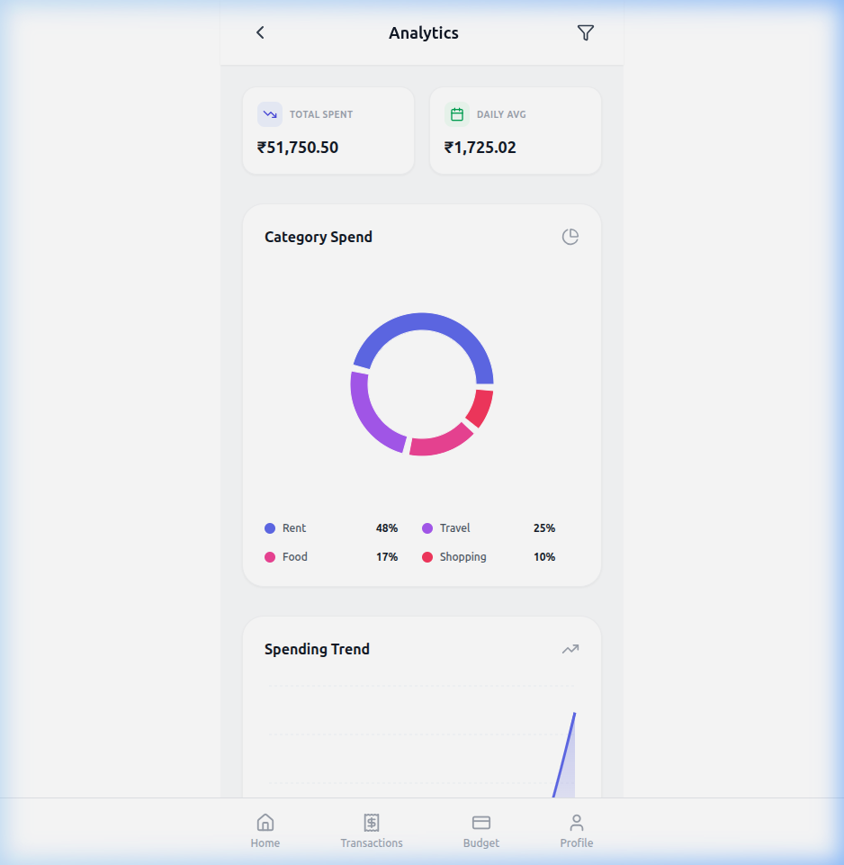
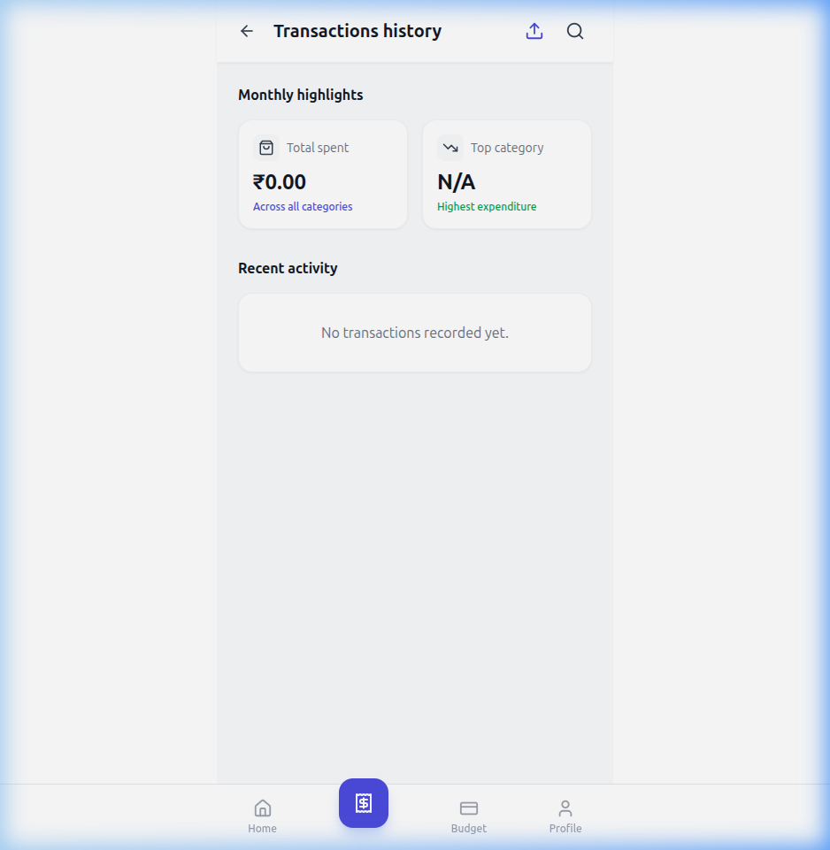
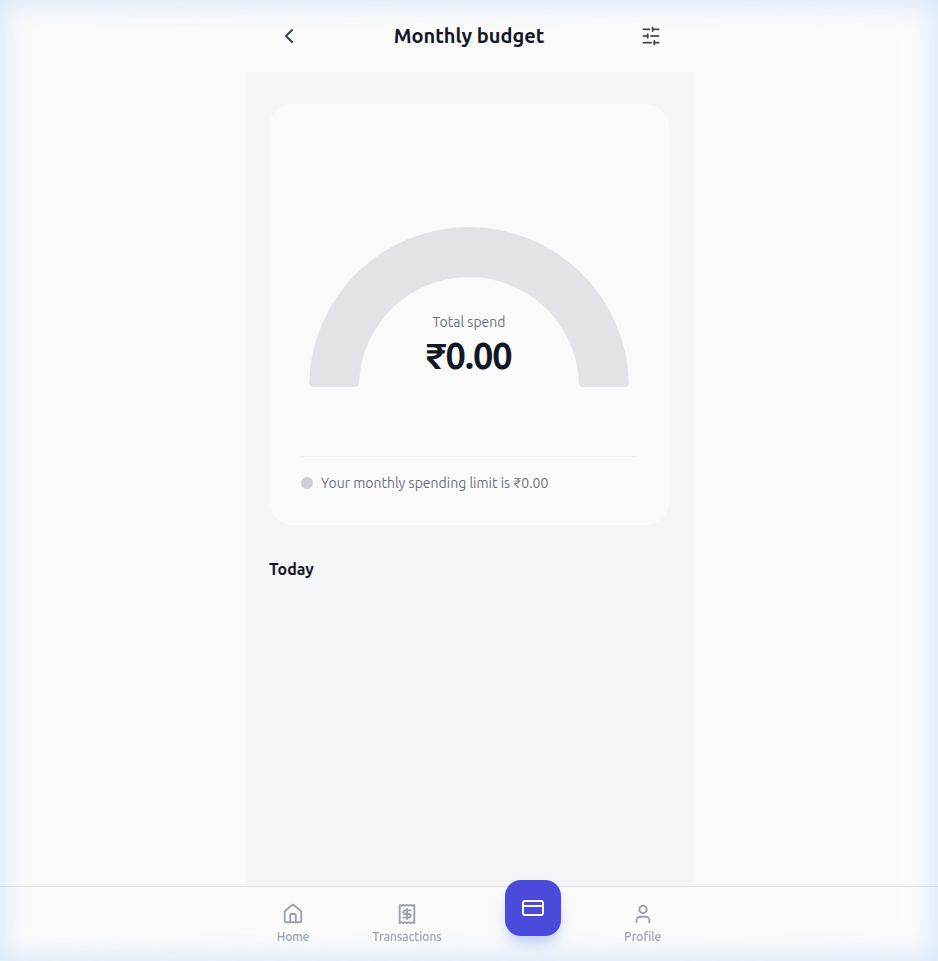
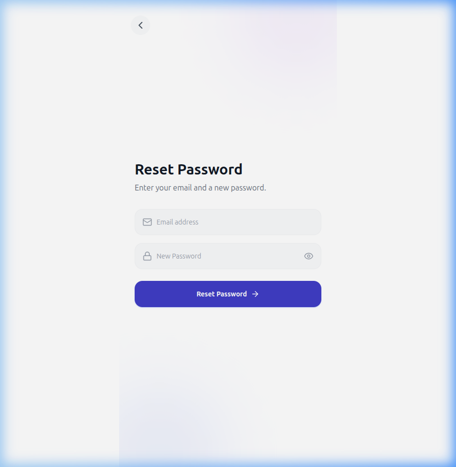

# 🐦 TrackNest - Smart Expense Tracker



> **🌍 Live Demo:** [Visit TrackNest App Here](#) *(Replace with your hosted URL)*

TrackNest is a sleek, modern, and powerful expense tracking application designed to help you take control of your finances. With a focus on user experience and data visualization, TrackNest makes managing your money simple and intuitive.

## ✨ Implemented Features

### 🔹 Authentication & Security
- **User Authentication**: Secure Sign Up, Login, and Logout functionality.
- **Password Management**: Forgot Password and Password Reset workflows.
- **PIN Protection**: Additional layer of security with an app-specific PIN.
- **JWT Sessions**: Secure backend communication using JSON Web Tokens.

### 🔹 Financial Tracking
- **Transaction Logging**: Quickly add new income or expense entries.
- **Categorization**: Group transactions by dynamically generated categories (Food, Rent, Travel, etc.).
- **Payment Methods**: Track how you pay (Credit Card, Cash, Bank Transfer).
- **Transaction History**: A detailed, scrollable log of all past financial activities.

### 🔹 Budgeting & Goals
- **Monthly Spending Limits**: Set a hard budget and track your spending against it.
- **Savings Goals**: Create custom goals (e.g., "Vacation Fund", "New Car") and track progress visually.
- **Dynamic Updates**: Budgets and goals update in real-time as new transactions are added.

### 🔹 Analytics & Visualization
- **Comprehensive Dashboard**: A bird's-eye view of your current balance, recent activity, and quick-add actions.
- **Spending Trends**: Line charts to visualize daily spending averages over time.
- **Category Breakdown**: Interactive doughnut charts displaying exactly where your money goes.
- **Monthly Highlights**: Quick insights into your top spending categories.

### 🔹 User Experience & Settings
- **Profile Management**: Update your name, email, and select a customized avatar.
- **Interactive UI**: Fluid micro-animations, glassmorphic cards, and responsive design.
- **Dark Mode / Light Mode**: Seamless theme toggling for user preference.
- **System Settings**: Manage notifications, app permissions, and help/support resources.

## 🛠️ Tech Stack

### Frontend
- **React.js**: Core UI framework
- **Tailwind CSS**: Modern styling and layout
- **Recharts**: Data visualization and analytics
- **Lucide React**: Beautiful icons
- **React Router**: Seamless navigation

### Backend
- **Django**: Robust Python web framework
- **Django REST Framework**: Secure and scalable API
- **SQLite**: Reliable local data storage (default)
- **JWT Authentication**: Secure user sessions

---

## 🚀 Getting Started

### Prerequisites
- Node.js (v16+)
- Python (v3.10+)
- npm or yarn

### 🔧 Backend Setup
1. Navigate to the backend directory:
   ```bash
   cd backend
   ```
2. Create and activate a virtual environment:
   ```bash
   python -m venv venv
   source venv/bin/activate  # On Windows: venv\Scripts\activate
   ```
3. Install dependencies:
   ```bash
   pip install -r requirements.txt
   ```
4. Run migrations:
   ```bash
   python manage.py migrate
   ```
5. Start the development server:
   ```bash
   python manage.py runserver
   ```

### 🎨 Frontend Setup
1. Navigate to the frontend directory:
   ```bash
   cd frontend
   ```
2. Install dependencies:
   ```bash
   npm install
   ```
3. Start the development server:
   ```bash
   npm start
   ```
Open [http://localhost:3000](http://localhost:3000) to view it in your browser.

---

## 📸 Screenshots

| Splash Screen | Login Page | Signup Page |
| :---: | :---: | :---: |
|  |  |  |

| Dashboard | Analytics | Transactions |
| :---: | :---: | :---: |
|  |  |  |

| Budget Planning | Forgot Password |
| :---: | :---: |
|  |  |

---

## 📁 Project Structure

```text
Expenses Tracker/
├── backend/            # Django REST API
│   ├── expenses/       # Core app logic and models
│   ├── expense_tracker/# Project settings
│   └── manage.py       # Django management script
├── frontend/           # React Application
│   ├── src/
│   │   ├── components/ # Reusable UI components
│   │   ├── pages/      # View components
│   │   └── api.js      # API interaction layer
│   └── public/         # Static assets
└── docs/               # Project documentation and screenshots
```

## 🤝 Contributing

This is a private, proprietary project. Contributions, pull requests, and unauthorized modifications are strictly prohibited.

## 📄 License

**All Rights Reserved.**

This project and its source code are proprietary. You may not copy, download, modify, distribute, or use this code without explicit written permission from the owner.
